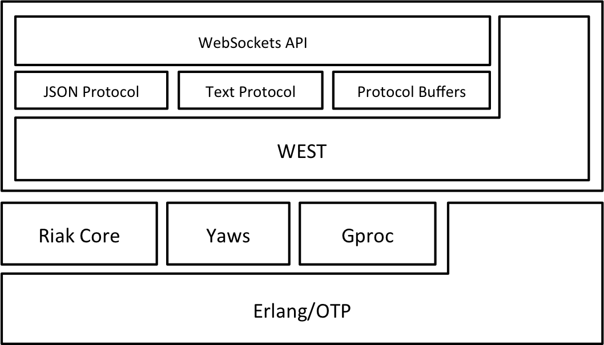

Web/Event-driven Systems Tool
=============================

__Authors:__ Carlos Andres Bolaños R.A. ([`cabol@niagara.io`](mailto:cabol@niagara.io)).

A new way to build real-time and high scalable messaging-based applications, not centralized but distributed!


Overview
--------

`WEST` is a simple and lightweight tool that enables easy development of distributed highly-scalable event-based systems,
[EDA](http://en.wikipedia.org/wiki/Event-driven_architecture) based systems, giving properties such as: massive concurrency,
fault-tolerance, horizontal scaling, high performance, and high availability. `WEST` breaks the traditional messaging systems
with centralized model (Broker, ESB, MoM, etc.), implementing a real P2P communication system.

`WEST` provides a number of useful features:

* Relies on remarkable, top notch and mature projects such as: [Gproc](https://github.com/uwiger/gproc), [Riak Core](https://github.com/basho/riak_core),
  [YAWS](http://yaws.hyber.org) / [Cowboy](http://ninenines.eu).

* Messaging patterns like Pub/Sub and Req/Rep.

* Provides an Erlang native client (fine-grained interface). This is useful if you want to run WEST embedded within another
  larger Erlang application. In this case, larger Erlang Apps should consume the native client instead of WebSocket API.

* Provides a coarse-grained interface via WebSockets in order that can be used by external applications, no matter the
  platform or programming language. You can integrate applications written in any language (C/C++, Java, CSharp, Python,
  Ruby, JavaScript, etc.) with WEST.

* WebSocket API comes with different protocols options such as: JSON, Text and Protocol Buffers.

* Provides two options to run in distributed fashion: 1) `west_dist` (Gproc + Riak Core) that implements a sharding topology
  enabling horizontal scaling and linear growth. 2) `gproc_dist` (Gproc global + [gen_leader](https://github.com/garret-smith/gen_leader_revival)).

* Also can run in a simpler way, local in a single node (this is the default behavior). In his case you don't need `riak_core`.

* WEST is flexible, you can add or remove pieces as you need.

* WEST provides two Web Server options: [Cowboy](http://ninenines.eu) or [YAWS](http://yaws.hyber.org).

About the infrastructure used by WEST:

* `gproc` (process dictionary for Erlang) serves as messaging infrastructure. WEST implements messaging patterns like Pub/Sub
  and Req/Rep using `gproc`.

* `riak_core` is used by WEST to run in distributed way. In this case, `gproc` runs locally on each node, and with
  `riak_core` WEST creates a Sharding topology, storing data records (channel keys in this case) across multiple
  gproc instances. Optionally, you can also configure more advanced topologies like Sharding + Peer-To-Peer Replication (like Riak).
  WEST runs by default with replication factor 1.

* `cowboy` or `yaws` serves as web server, in order to provide WebSockets infrastructure mainly.


Dependencies
------------

WEST has main dependencies such as: `gproc`, `mochiweb`, and `protobuffs`. These dependencies are fetched by default.
Due to WEST exposes a WebSocket API, `cowboy` dependency is fetched too, despite to be complementary (can be skip it if you want).

There are others complementary dependencies like `yaws` and `riak_core`. Since most people don't actively use either,
they are no longer fetched by default, but they can be fetched on demand.

To enable fetching complementary dependencies you must export the corresponding OS environment variable, depending on what
dependency you want to fetch.

* To enable fetching of `riak_core` and support distributed WEST, export the OS environment variable `WEST_DIST=true`.

* To enable fetching of `yaws`, export the OS environment variable `WEST_YAWS=true`.

* No need to do anything for `cowboy`, is fetched by default, instead if you want to skip it, export the OS environment variable
  `WEST_COWBOY=false`.

* For ease, if you want to fetch all dependencies, export the OS environment variable `WEST_ALL=true`.

This can be done e.g. from a GNU Makefile, from shell (CLI), or editing your `.bash_profile`/`.bashrc` (Unix, Linux, Mac OSX).

E.g. supposing that you want to set the OS variables permanently, in your home directory, edit `.bashrc` or `.bash_profile`
to add these lines:

    export WEST_DIST=true
    export WEST_YAWS=true
    export WEST_COWBOY=false


Building WEST
-------------

Assuming you have a working Erlang (R16B02 or later) installation, building WEST should be as simple as:

        $ git clone https://github.com/cabol/west.git
        $ cd west
        $ make rel

* Note: remember set the OS variables that you need before to build WEST in order to fetch the necessary dependencies (check
  dependencies section above).


Configuring WEST
----------------

Once you have built WEST, a folder `west` (your build) is created within `rel` folder (`./rel/west`), with this structure:

    .
    |__rel
       |__west
          |__bin
             |__west
             |__west-admin
          |__etc
             |__app.config
             |__vm.args
          ...

In your build `rel/west` you'll find:

* `/etc/app.config`: This file contains configuration for WEST and support applications (Riak Core, Cowboy, Yaws, Sasl).
  If you need to change default configuration, this is the file that you need to modify.
* `/etc/vm.args`: This file contains the arguments that are passed to Erlang VM when is executed. If you need to add or
  modify VM arguments, this is the place to do it.
* `/bin/west`: WEST executable.
* `/bin/west-admin`: WEST admin executable.


Starting WEST
-------------

Once you have successfully built WEST, you can start the server with the following commands:

    $ cd $WEST/rel/west
    $ bin/west start

Note that the $WEST/rel/west directory is a complete, self-contained instance of WEST and Erlang. It is strongly
suggested that you move this directory outside the source tree if you plan to run a production instance.

Now, due to WEST was started as daemon, if you want to see what is happening, you can attach your console to
WEST process.

    $ ./rel/west/bin/west attach

You can use `west` from web client ([http://localhost:8080](http://localhost:8080)) or directly with Erlang
`west` module. See below the different ways to use it and test it.

* Note: WEST doesn't runs in distributed fashion by default, it runs locally in each node and just relies on Gproc.
  If you want to run distributed WEST, you will need `riak_core` dependency, and you must change `dist` property
  (from `gproc` to `west_dist`) in `etc/app.config` (WEST section):
  
    ```erlang
    {west, [
            {dist, west_dist}
            ...
           ]
    }    
    ```


Distributed WEST
----------------

The application `west` is distributed by nature, and its distribution model relies on `riak_core` as distributed
framework to balance the requests around the cluster, and `gproc` that runs locally on each node and provides the
extended process dictionary and messaging patterns (point-to-point and publish-subscribe).

* Note: To run WEST in distributed fashion you need `riak_core` dependency. Therefore, when you built WEST you
  should have set the OS variable `WEST_DIST=true`.


### Build the devrel ###

We going to build `devrel` stage, in order to create tree nodes (default) and set them up in cluster.

    $ make
    $ make devrel

* Note that you can generate more nodes if you want, you have to modify the release files if you want it automatic.
  But you can also copy the the `dev` node as much as you want, and modify the configuration files on each copied
  node (dev#/etc/*). Now we just going to follow default building.

### Start the Cluster ###

    $ for d in dev/dev*; do $d/bin/west start; done
    $ for d in dev/dev{2,3}; do $d/bin/west-admin join west1@127.0.0.1; done

In tha same way as previously, you can attach your console to any WEST daemon. For example, let's see what
is happening with vnode 1 (dev1):

    $ ./dev/dev1/bin/west attach

Now you have tree nodes running in cluster, we're ready to use `west` distributed.

You can use `west` from web client or directly with `west` module. See below the different ways to use it
and test it.

NOTE: If you don't want to run WEST as daemons, alternatively, you can start each vnode from the console
(instead of `west attach`). Open tree instances of console and run each WEST vnode respectively.
    
    $ ./dev/dev#/bin/west console


WEST Web Client
---------------

WEST contains a web user interface, in order to provide to the users a simple way to interact with it.

You can open a tab in your browser and set the URL `http://host:port/index.html`. You can use this
web client to work with `west`. In the page are instructions to get started.

Note that the `host` and `port` are Web Server properties, and you can find them in the `/etc/app.config` file,
if you want to change them.

If you ran `west` in single node, from `./rel/west/bin`, you can try:
[http://localhost:8080](http://localhost:8080)

### Note ###

If you are running `west` in cluster, and you have several instances of Web Server listen in different
`host:port`, you can open several browser TABs, pointing to different `west` instances, e.g.: some tabs
to `http://HostX:PortX/index.html`, others to `http://HostY:PortY/index.html`, and in this way to others
(is like a manual HTTP load balancing).

Now you can try:
[http://localhost:8081](http://localhost:8081)
[http://localhost:8082](http://localhost:8082)
[http://localhost:8083](http://localhost:8083)


WEST Native Client
------------------

Is possible interact with `west` in programmatic way with Erlang using the native `west` module.

    $ ./rel/west/bin/west console
    (west@127.0.0.1)1> F = fun(Event, Args) -> io:format("Event: ~p~nArgs: ~p~n", [Event, Args]) end.
    #Fun<erl_eval.12.80484245>
    (west@127.0.0.1)2> {ok, Pid} = west:start_link("u1", {none, F, ["Hello"]}, []).
    {ok,<0.416.0>}
    (west@127.0.0.1)3> {ok, Pid2} = west:start_link("u2", {none, F, ["Hello"]}, []).
    {ok,<0.433.0>}
    (west@127.0.0.1)4>
    (west@127.0.0.1)4> west:reg(Pid, <<"r1">>).
    {ok,{message,<<"registration_succeeded">>,<<"r1">>,<<"west">>,undefined,undefined}}
    (west@127.0.0.1)5>
    (west@127.0.0.1)5> west:reg(Pid2, <<"r2">>).
    {ok,{message,<<"registration_succeeded">>,<<"r2">>,<<"west">>,undefined,undefined}}
    (west@127.0.0.1)6>
    (west@127.0.0.1)6>

So far, we've created two clients to `west`, and one is registered to channel `r1` and other to channel
`r2`. Now let's send some messages:

    (west@127.0.0.1)6>
    (west@127.0.0.1)6> west:send(Pid, <<"r2">>, "hello!").
    Event: {"u1",r2,"hello!"}
    Args: ["Hello"]
    {ok,{message,<<"sending_succeeded">>,<<"r2">>,<<"west">>,undefined,undefined}}
    (west@127.0.0.1)7>
    (west@127.0.0.1)7> west:send(Pid2, <<"r1">>, "hello!").
    Event: {"u2",r1,"hello!"}
    Args: ["Hello"]
    {ok,{message,<<"sending_succeeded">>,<<"r1">>,<<"west">>,undefined,undefined}}
    (west@127.0.0.1)8>
    (west@127.0.0.1)8>

Now, let's test a pub/sub scenario. We going to subscribe `Pid` and `Pid2` to pub/sub channel `ps1`,
and after we'll publish some messages.

    (west@127.0.0.1)8>
    (west@127.0.0.1)8> west:sub(Pid, <<"ps1">>).
    {ok,{message,<<"subscription_succeeded">>,<<"ps1">>,<<"west">>,undefined,undefined}}
    (west@127.0.0.1)9>
    (west@127.0.0.1)9> west:sub(Pid2, <<"ps1">>).
    {ok,{message,<<"subscription_succeeded">>,<<"ps1">>,<<"west">>,undefined,undefined}}
    (west@127.0.0.1)10>
    (west@127.0.0.1)10> west:pub(Pid, <<"ps1">>, "All").
    Event: {"u1",ps1,"All"}
    Args: ["Hello"]
    Event: {"u1",ps1,"All"}
    Args: ["Hello"]
    {ok,{message,<<"publication_succeeded">>,<<"ps1">>,<<"west">>,undefined,undefined}}
    (west@127.0.0.1)11>
    (west@127.0.0.1)11> west:pub(Pid2, <<"ps1">>, "All").
    Event: {"u2",ps1,"All"}
    Args: ["Hello"]
    Event: {"u2",ps1,"All"}
    Args: ["Hello"]
    {ok,{message,<<"publication_succeeded">>,<<"ps1">>,<<"west">>,undefined,undefined}}
    (west@127.0.0.1)12>

Note that either `Pid` and `Pid2` received the published messages, both executed the callback function.


WEST with GPROC_DIST
--------------------

WEST has other way to run in cluster, supported on `gproc_dist`, which consists in using `gproc` distributed
model based on `gen_leader` (see [Gproc](https://github.com/uwiger/gproc)).

1. You need to modify the `/etc/app.config` file:

    ```erlang
    [
     {west, [ {dist, gproc_dist} ]}
    ].
    ```

2. Add the `-gproc gproc_dist all` to the vm arguments in `/etc/vm.args` file:

    ```
    -gproc gproc_dist all
    ```

3. Start `west` in cluster, in the same way explained previously.

4. Now you need to restart `gproc` on each node, in order that it can configure itself.

        ./dev/dev1/bin/west attach
        (west1@127.0.0.1)1> rpc:multicall(application, stop, [gproc]).
        {[ok,ok,ok],[]}
        (west1@127.0.0.1)2> rpc:multicall(application, start, [gproc]).
        {[ok,ok,ok],[]}

However, is recommended run `west` in distributed fashion with `gproc` local and `riak_core` support.


Implementation Notes
--------------------

### Top-level layers view ###




Annexes
-------


### Building Edoc ###


No supported yet.
