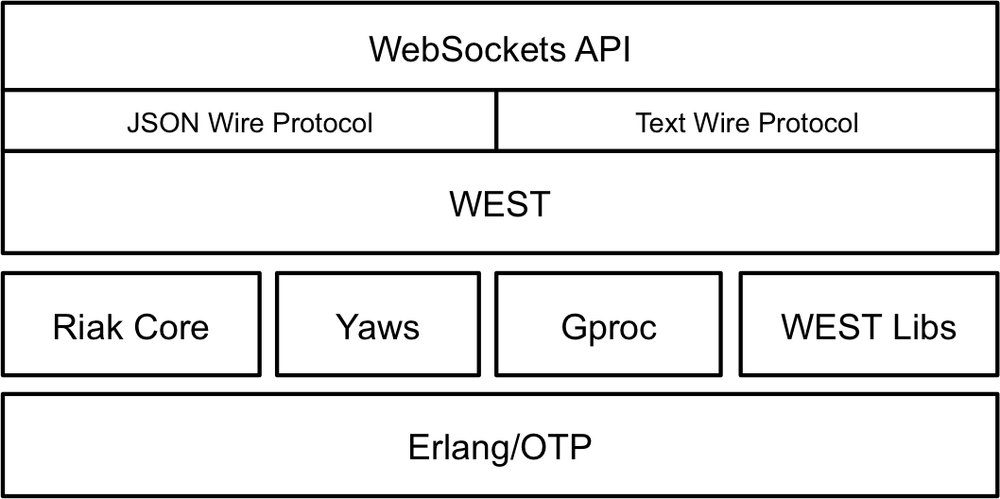
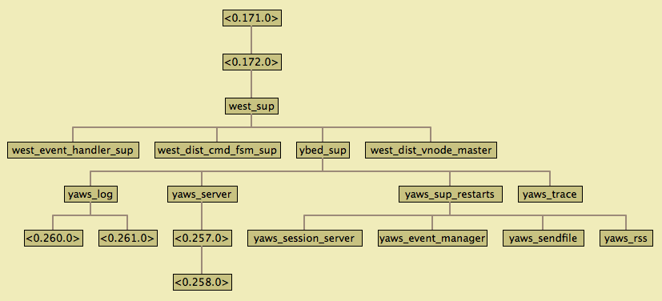

Web-Event-Driven System's Tool
==============================

__Authors:__ Carlos Andres Bolaños R.A. ([`cabolanos-dev@gmail.com`](mailto:cabolanos-dev@gmail.com)).

A new way to build real-time and high scalable messaging-based applications, not centralized but distributed!


Overview
--------

`WEST` (Web/Event-Driven Systems Tool) is a tool that enables the development of real-time, mission-critical and
messaging-based systems, [EDA](http://en.wikipedia.org/wiki/Event-driven_architecture) based systems, giving
properties such as: massive concurrency, fault-tolerance, high scalability, high performance, and high availability.

`WEST` is written in `Erlang/OTP`, enables messaging patterns like Pub/Sub and Request/Reply. Also comes with a
WebSockets API and different protocols options such as: JSON, Text and Protocol Buffers, in order to interact with it.
`WEST` breaks the traditional messaging systems with centralized model (Broker, ESB, MoM, etc.), implementing a real
P2P communication system.


Dependencies
------------

WEST uses some project as support infrastructure.

* `gproc` as extended process dictionary and pub/sub infrastructure.
* `riak_core` as distributed framework in order to scale out. With this distributed model, `gproc` runs locally
  in each node, and `riak_core` is used to distribute the processes around the cluster.
* `yaws` as web server, this provides the WebSockets infrastructure.


Building WEST
-------------

Assuming you have a working Erlang (R16B02 or later) installation, building WEST should be as simple as:

        $ git clone https://github.com/cabolanos/west.git
        $ cd west
        $ make rel


Starting WEST
-------------

Once you have successfully built WEST, you can start the server with the following commands:

    $ cd $WEST/rel/west
    $ bin/west start

Note that the $WEST/rel/west directory is a complete, self-contained instance of WEST and Erlang. It is strongly
suggested that you move this directory outside the source tree if you plan to run a production instance.

Now, due to WEST was started as daemon, if you want to see what is happening, you can attach your console to
WEST process.

    $ ./rel/west/bin/west attach

You can use `west` from web client ([http://localhost:8080](http://localhost:8080)) or directly with Erlang
`west_client`. See below the different ways to use it and test it.


Distributed WEST
----------------

The application `west` is distributed by nature, and its distribution model resides on `riak_core` as distributed
framework to balance the requests around the cluster, and `gproc` that runs locally on each node and provides the
extended process dictionary and messaging patterns (point-to-point and publish-subscribe).


### Build the devrel ###

We going to build `devrel` stage, in order to create tree nodes (default) and set them up in cluster.

    $ make
    $ make devrel

* Note that you can generate more nodes if you want, you have to modify the release files if you want it automatic.
  But you can also copy the the `dev` node as much as you want, and modify the configuration files on each copied
  node (dev#/etc/*). Now we just going to follow default building.

### Start the Cluster ###

    $ for d in dev/dev*; do $d/bin/west start; done
    $ for d in dev/dev{2,3}; do $d/bin/west-admin join west1@127.0.0.1; done

In tha same way as previously, you can attach your console to any WEST daemon. For example, let's see what
is happening with vnode 1 (dev1):

    $ ./dev/dev1/bin/west attach

Now you have tree nodes running in cluster, we're ready to use `west` distributed.

You can use `west` from web client or directly with `west_client`. See below the different ways to use it
and test it.

NOTE: If you don't want to run WEST as daemons, alternatively, you can start each vnode from the console
(instead of `west attach`). Open tree instances of console and run each WEST vnode respectively.

    $ ./dev/dev#/bin/west console


WEST Web Client
---------------

WEST contains a web user interface, in order to provide to the users a simple way to interact with it.

You can open a tab in your browser and set the URL `http://host:port/index.html`. You can use this
web client to work with `west`. In the page are instructions to get started.

Note that the `host` and `port` are the same of `yaws`, and you can find them in the `/etc/app.config` file,
if you want to change them.

If you ran `west` in single node, from `./rel/west/bin`, you can try:
[http://localhost:8080](http://localhost:8080)

### Note ###

If you are running `west` in cluster, and you have several instances of `yaws` listen in different
`host:port`, you can open several browser TABs, pointing to different `west` instances, ex.: some tabs
to `http://HostX:PortX/index.html`, others to `http://HostY:PortY/index.html`, and in this way to others
(is like a manual HTTP load balancing).

Now you can try:
[http://localhost:8081](http://localhost:8081)
[http://localhost:8082](http://localhost:8082)
[http://localhost:8083](http://localhost:8083)


WEST Erlang Client
------------------

Is possible interact with `west` in programmatic way with Erlang using the module `west_client`.

    $ ./rel/west/bin/west console
    (west@127.0.0.1)1> F = fun(Event, Args) -> io:format("Event: ~p~nArgs: ~p~n", [Event, Args]) end.
    #Fun<erl_eval.12.80484245>
    (west@127.0.0.1)2> {ok, Pid} = west_client:start_link("u1", {none, F, ["Hello"]}, []).
    {ok,<0.416.0>}
    (west@127.0.0.1)3> {ok, Pid2} = west_client:start_link("u2", {none, F, ["Hello"]}, []).
    {ok,<0.433.0>}
    (west@127.0.0.1)4>
    (west@127.0.0.1)4> west_client:reg(Pid, "r1").
    {ok,{message,"registration_succeeded","r1","west",undefined,
                 "Reg ok."}}
    (west@127.0.0.1)5>
    (west@127.0.0.1)5> west_client:reg(Pid2, "r2").
    {ok,{message,"registration_succeeded","r2","west",undefined,
                 "Reg ok."}}
    (west@127.0.0.1)6>
    (west@127.0.0.1)6>

So far, we've created two clients to `west`, and one is registered to channel `r1` and other to channel
`r2`. Now let's send some messages:

    (west@127.0.0.1)6>
    (west@127.0.0.1)6> west_client:send(Pid, "r2", "hello!").
    Event: {"u1",r2,"hello!"}
    Args: ["Hello"]
    {ok,{message,"sending_succeeded","r2","west",undefined,
                 "Message sent."}}
    (west@127.0.0.1)7>
    (west@127.0.0.1)7> west_client:send(Pid2, "r1", "hello!").
    Event: {"u2",r1,"hello!"}
    Args: ["Hello"]
    {ok,{message,"sending_succeeded","r1","west",undefined,
                 "Message sent."}}
    (west@127.0.0.1)8>
    (west@127.0.0.1)8>

Now, let's test a pub/sub scenario. We going to subscribe `Pid` and `Pid2` to pub/sub channel `ps1`,
and after we'll publish some messages.

    (west@127.0.0.1)8>
    (west@127.0.0.1)8> west_client:sub(Pid, "ps1").
    {ok,{message,"subscription_succeeded","ps1","west",
                 undefined,"Subscription ok."}}
    (west@127.0.0.1)9>
    (west@127.0.0.1)9> west_client:sub(Pid2, "ps1").
    {ok,{message,"subscription_succeeded","ps1","west",
                 undefined,"Subscription ok."}}
    (west@127.0.0.1)10>
    (west@127.0.0.1)10> west_client:pub(Pid, "ps1", "All").
    Event: {"u1",ps1,"All"}
    Args: ["Hello"]
    Event: {"u1",ps1,"All"}
    Args: ["Hello"]
    {ok,{message,"publication_succeeded","ps1","west",undefined,
                 "Message published."}}
    (west@127.0.0.1)11>
    (west@127.0.0.1)11> west_client:pub(Pid2, "ps1", "All").
    Event: {"u2",ps1,"All"}
    Args: ["Hello"]
    Event: {"u2",ps1,"All"}
    Args: ["Hello"]
    {ok,{message,"publication_succeeded","ps1","west",undefined,
                 "Message published."}}
    (west@127.0.0.1)12>

Note that either `Pid` and `Pid2` received the published messages, both executed the callback function.


WEST with gproc_dist
--------------------

WEST has other way to run in cluster, supported on `gproc_dist`, this is using the `gproc` distributed
model based on `gen_leader`.

1. You need to modify the `/etc/app.config` file:

    ```erlang
    [
     {west, [ {dist, gproc_dist} ]}
    ].
    ```

2. Add the `-gproc gproc_dist all` to the vm arguments in `/etc/vm.args` file:

    ```
    -gproc gproc_dist all
    ```

3. Start `west` in cluster, in the same way explained previously.

4. Now you need to restart `gproc` on each node, in order that it can configure itself.

        ./dev/dev1/bin/west attach
        (west1@127.0.0.1)1> rpc:multicall(application, stop, [gproc]).
        {[ok,ok,ok],[]}
        (west1@127.0.0.1)2> rpc:multicall(application, start, [gproc]).
        {[ok,ok,ok],[]}

However, is recommended run `west` distributed in default way, with `gproc` local and `riak_core` support.


Implementation Notes
--------------------

### Top-level layers view ###



### Overview of supervision ###




Annexes
-------


### Building Edoc ###


No supported yet.
